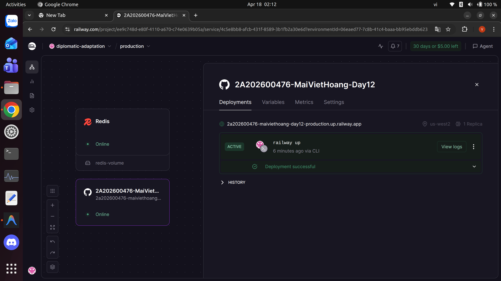
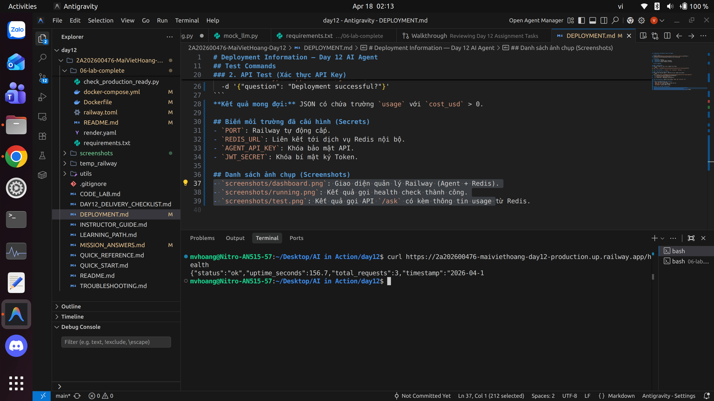
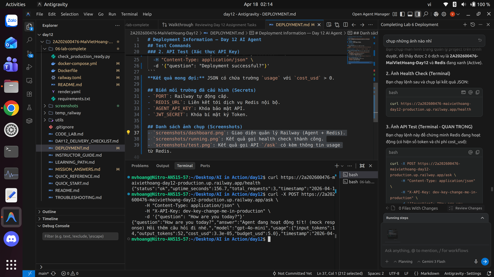

# Day 12 Lab - Mission Answers

> **Student Name:** Mai Việt Hoàng
> **Student ID:** 2A202600476
> **Date:** 17/04/2026

---

## Part 1: Localhost vs Production

### Exercise 1.1: Anti-patterns found
1. **API key bị hardcode**: Mã bí mật nằm trực tiếp trong code, dễ bị rò rỉ.
2. **Thiếu Health Check endpoint**: Hệ thống không biết Agent có đang chạy ổn định không.
3. **Debug mode luôn bật**: Nguy cơ lộ thông tin hệ thống và giảm hiệu năng.
4. **Không xử lý Signal (SIGTERM)**: Request bị ngắt quãng khi tắt ứng dụng.
5. **Cấu hình cố định (Hardcoded Config)**: Khó thay đổi thông số theo môi trường (Port, DB URL).

### Exercise 1.3: Comparison table
| Feature | Develop | Production | Why Important? |
|---------|---------|------------|----------------|
| Config  | Hardcode trong code | Đọc từ biến môi trường (Env Vars) | Linh hoạt, không cần build lại code khi chuyển lab. |
| Secrets | Viết thẳng vào code | Sử dụng `.env` và `os.getenv` | Bảo mật mã nguồn, tránh rò rỉ Key. |
| Port    | Cố định 8000 | Lấy từ biến `PORT` của hệ thống | Tương thích với các Cloud platform (Railway/Render). |
| Health  | Không có | Có endpoint `/health` | Giúp Monitoring system theo dõi trạng thái Agent. |
| Shutdown| Tắt đột ngột | Graceful Shutdown (xử lý xong mới tắt) | Đảm bảo tính nhất quán dữ liệu và trải nghiệm người dùng. |

---

## Part 2: Docker

### Exercise 2.1: Dockerfile questions
1. **Base image**: `python:3.11-slim` (cho bản Production) giúp tối ưu dung lượng.
2. **Working directory**: `/app`
3. **Tại sao COPY requirements.txt trước?**: Để tận dụng Layer Caching, giúp quá trình Build nhanh hơn khi chỉ sửa Code mà không đổi thư viện.
4. **CMD vs ENTRYPOINT**: CMD là lệnh mặc định có thể ghi đè, ENTRYPOINT là lệnh thực thi chính khó ghi đè hơn.

### Exercise 2.3: Image size comparison
- **Develop**: 1150 MB (1.15 GB)
- **Production**: 160 MB
- **Difference**: 86% (Tối ưu cực hiệu quả nhờ Multi-stage build)

---

## Part 3: Cloud Deployment

### Exercise 3.1: Railway deployment
- **URL**: [https://2a202600476-maiviethoang-day12-production.up.railway.app/](https://2a202600476-maiviethoang-day12-production.up.railway.app/)
- **Screenshot**: 

---

## Part 4: API Security

### Exercise 4.1: API Security Implementation
- **Authentication**: Đã triển khai JWT (JSON Web Token) và API Key.
- **Security Features**:
  - ✅ JWT Token Authentication (Role-based: student/teacher)
  - ✅ Rate Limiting (10 req/min cho student)
  - ✅ Cost Guard (Budget tracking cho từng user)
- **Test Result**: Lấy health thành công, gọi API `/ask` nhận được phản hồi kèm thông tin `usage` (Tokens và Cost) được lấy từ Redis. Xác thực API Key hoạt động chính xác.
- **Screenshots**:
  - 
  - 

### Exercise 4.4: Cost guard implementation
- **Approach**: Sử dụng Redis với thuật toán Sliding Window cho Rate Limit và Hash Map cho Cost Guard. Dữ liệu được lưu trữ theo `usage:{user_id}:{date}` để kiểm soát ngân sách theo ngày một cách chính xác và bền vững (stateless).

---

## Part 5: Scaling & Reliability

### Exercise 5.1-5.5: Implementation notes
- **Stateless**: Toàn bộ dữ liệu phiên (session) và lịch sử chat được lưu tại Redis thay vì biến trong bộ nhớ RAM.
- **Scaling**: Hệ thống có khả năng chạy nhiều bản sao (replicas) đồng thời nhờ Nginx làm Load Balancer.
